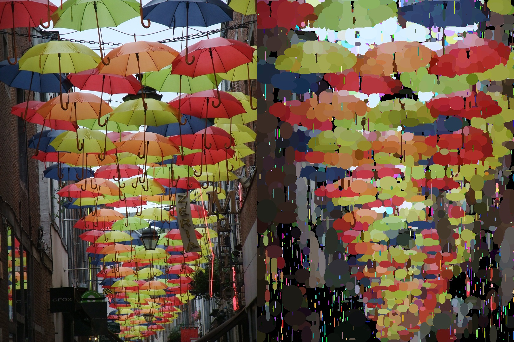

This is the multi-threaded version of the program. The single-threaded version is located here:  
https://github.com/MKCAMK/genetic_evolution_of_images

# Genetic Evolution of Images

A toy application which evolves a randomly generated image ever closer to the target image, based on the principles of genetic evolution. Windows version only.

Originally inspired by the video "Evolving Darwin - Genetic Algorithm" by Robert Cox and Micheal Muirden:  
https://www.youtube.com/watch?v=dO05XcXLxGs

## Evolution

1. A target image is selected by the user - an image to be used as a target for the "**evolution**".

2. A number of "**individuals**" - images - are created. Each individual possesses a "**genotype**": a series of "**genes**" - ellipses - each with a randomly generated size, color, and position. Drawing all the genes in the genotype produces a "**phenotype**" - final image.

3. All the individuals are compared with the target image pixel by pixel, and rated by how different they are from it. The lower the rating, the more similar the individual is to the target.

4. The individuals are sorted by rating, from the lowest rated to the highest.

5. The single lowest rated individual is presented on the screen.

6. The higher rated half of the individuals is removed, and replaced with a copy of the lower rated half. During the copying, each gene has a chance of a "**mutation**" - change in its properties.

7. The newly copied individuals are rated.

8. The program loops back to point 4.

Over generations, individuals in the "**population**" become more similar to the target. The image presented on the right side of the application window is the individual representing the current pinnacle of this evolution.

## Technical

Provided as a Visual Studio 2019 solution.

This version of the program creates additional worker sub-threads, which assist the main worker thread in drawing and rating of images. A simpler, single-threaded version is available here:  
https://github.com/MKCAMK/genetic_evolution_of_images

The application window is made with WinApi; drawing, both in the window and in the evolution, is done in GDI; GDI+ is used to help with transparency when combining partial images from sub-threads. Thus, only a Windows version.

## Settings

In order to achieve a good balance between the speed of the evolution and the visual quality of the evolved image, it is crucial to give a good thought to the parameters that will be used.

The program spends virtually all of its running time doing two things: drawing the ellipses; and rating the resulting image.

------------------

In theory, increasing the "Number of images used in the evolution" can produce better looking results, as the evolution can explore more of the sample space in a single generation. In practice, this effect is negligible, and the increase in the program's running time is linear, as each additional image has its own drawing, and rating phase. Therefore, it is better to keep this setting low, even at the lowest possible value: "2".

------------------

The resolution of the target image decides the time it takes to rate the evolved image, as it decides how many pixels needs to be compared - twice as many pixels, means twice as much time; trice as many pixels... It is a good idea to reduce the resolution of the desired target image as much as possible before starting.

The time taken by the process of rating can also be reduced by increasing the "Comparison's precision" setting. This describes the length of the stride that is taken between each pixel used for the comparison. When set to "1", all pixels are compared (a stride of one); when set to "5", every fifth pixel is compared (a stride of five) - this is five times as fast. Higher values, however, introduce artefacts, and make it generally more difficult to evolve a good looking image.

It is possible to use higher values for "Comparison's precision" as an offset for a high resolution target image, as a bigger picture is less affected by a decrease in the visual quality anyway.

------------------

The number of ellipses used in the evolution decides how much time the drawing phase takes, but also how much detail of the target image can the evolved image represent. More ellipses mean more detail and lower speed. On the other hand, if there are too few ellipses to even cover the drawing area, the ellipses will have to stretch to compensate, resulting in big blobs of a single color.

One possible strategy is to make sure that there are just enough ellipses to cover all of the drawing area, and that they are of a size roughly corresponding to the size of the target image features that are to be recreated in the evolving image. If ellipses are too large or too small at the creation, this can be adjusted using the "Limit to the size of an ellipse at its creation" setting.

------------------

One thing to remember when setting the number of ellipses, is its interplay with the mutation rate. When the ellipse count increases, but the mutation rate stays the same, the result is a higher number of ellipses mutating each generation. This could lead to difficulties in reproducing fine details of the target. For this reason, a higher number of ellipses should usually be paired with a lower mutation rate. A high mutation rate will lead to a faster evolution of general shapes, though.

Finally, note that the mutation rate is entered as the denominator in 1/N. If "100" is the input, then each ellipse has a 1/100 chance of a mutation, and with 500 ellipses, 5 ellipses will mutate on average in each generation.

